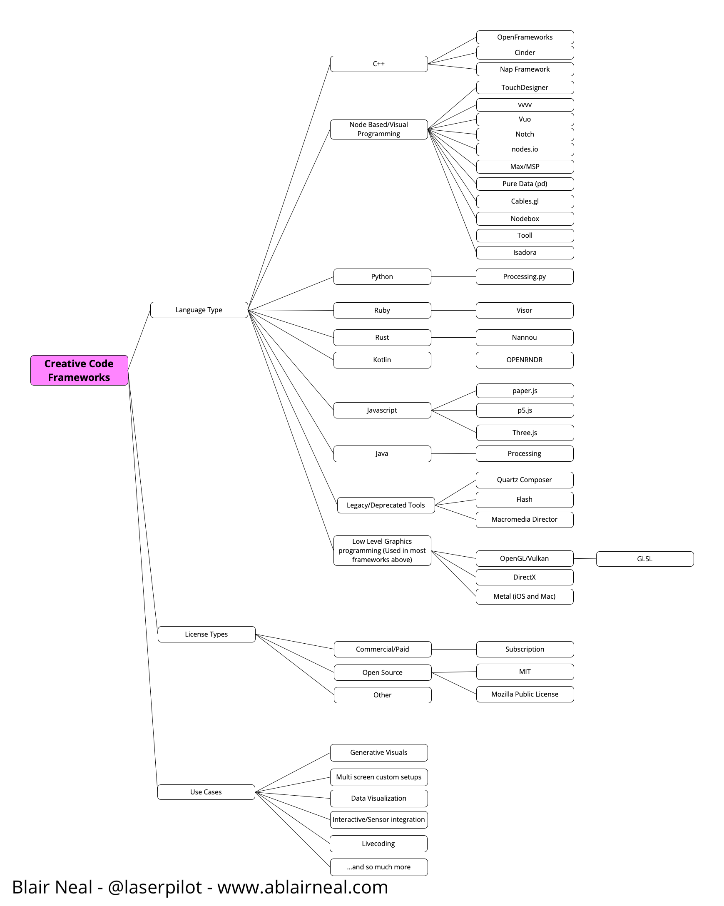
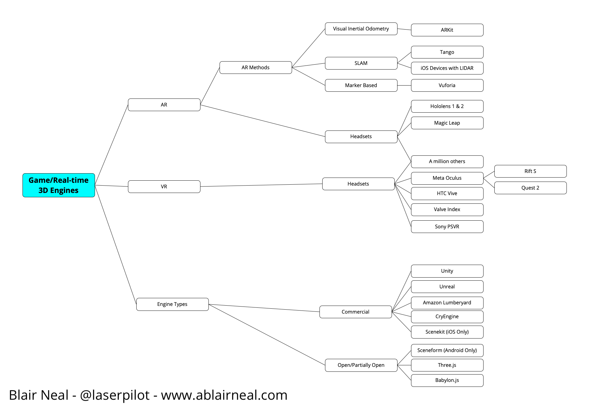
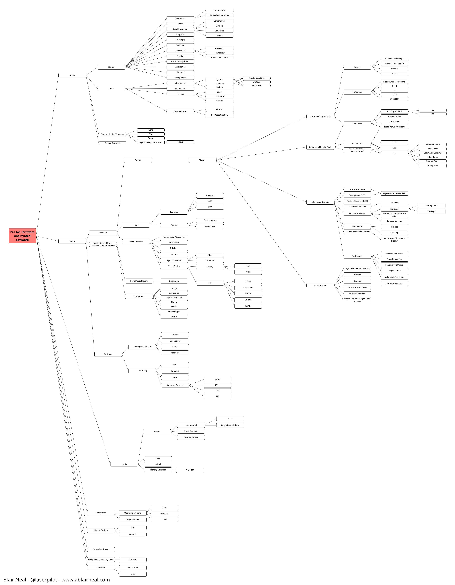
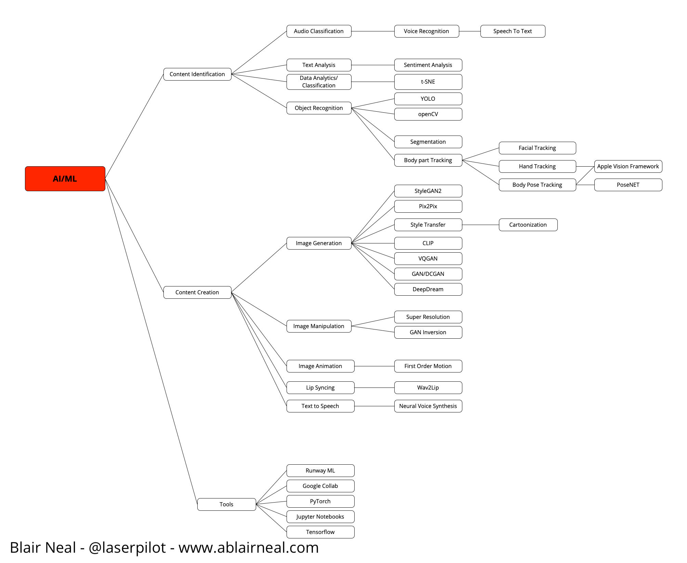
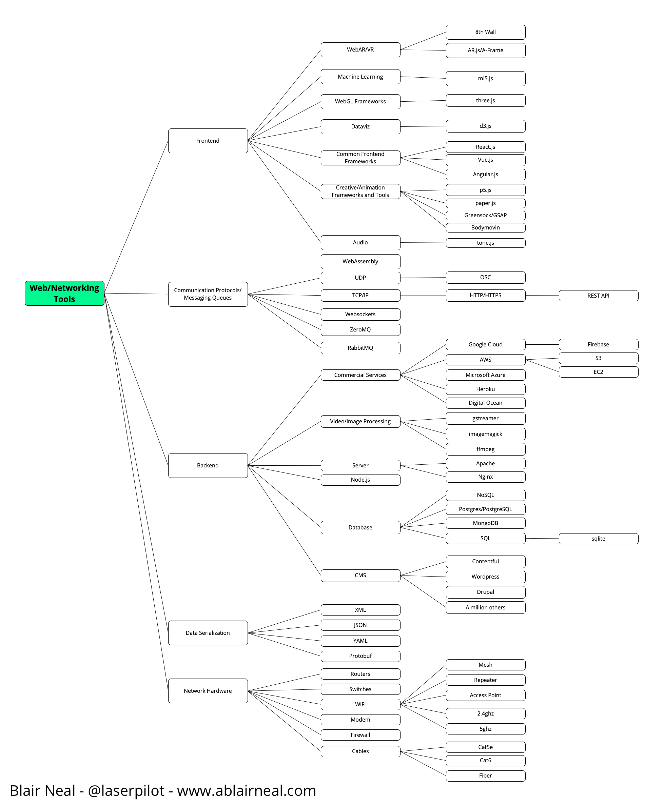
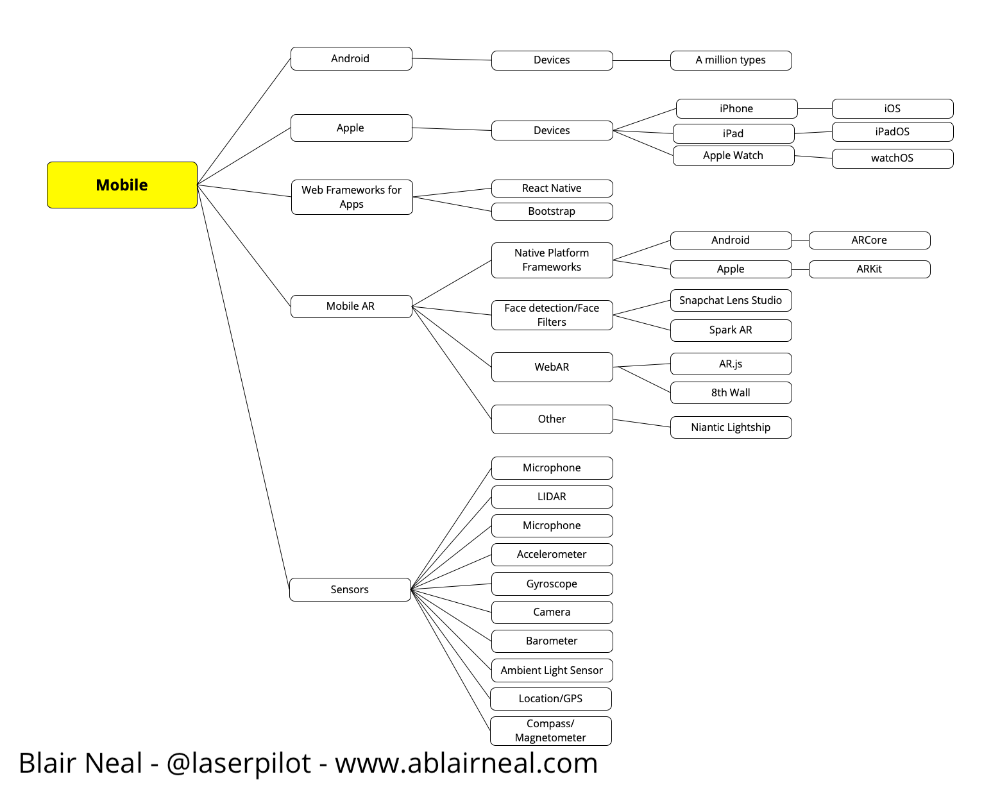
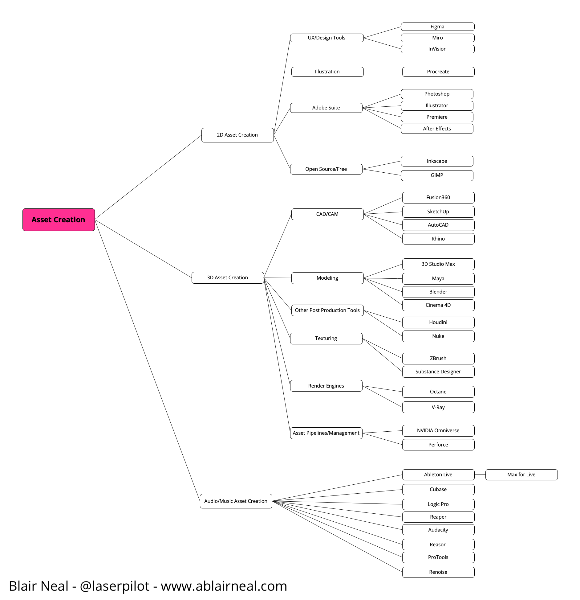
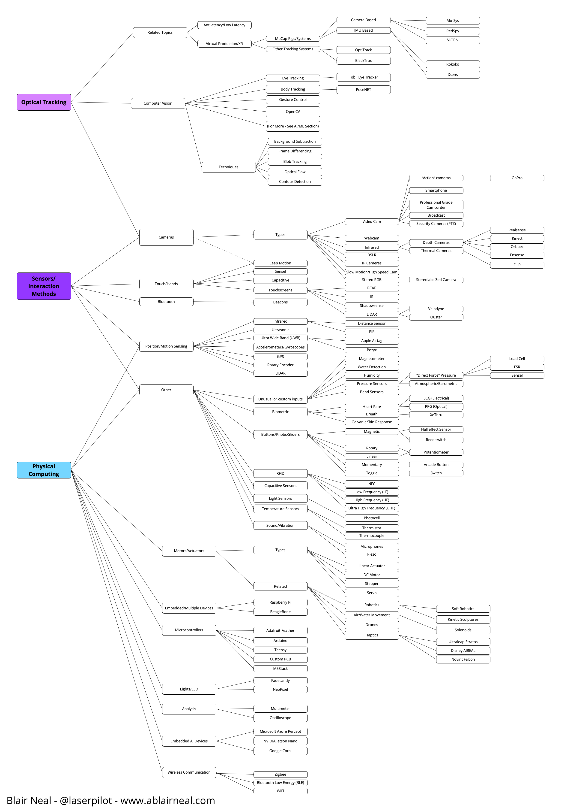
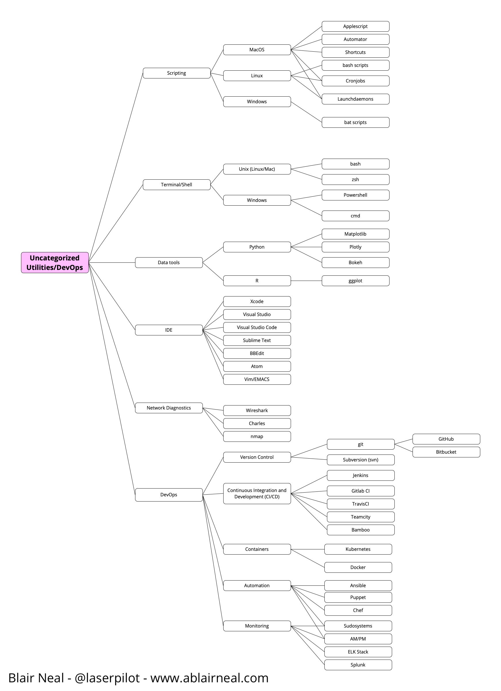

# Creative Tech Taxonomy

## View the current taxonomy at the link [here](https://laserpilot.github.io/Creative_Tech_Taxonomy/)

 An open taxonomy of software, hardware, and concepts related to creative technology and creative coding. Many relationships and hierarchies between topics are very subjective and have many flaws, so please don't take these too seriously - if you have a correction or suggestion, please submit a pull request. This is a labor of love and not meant to be too prescriptive, just illustrative.

 This was created because taxonomies for this undefined space are important tools for developing a common language and grammar to better enable communication and education. Read more of my longwinded thoughts on all that in my post [here](https://ablairneal.com/a-creative-technology-taxonomy).

 Originally created as a visual map [here](https://twitter.com/laserpilot/status/1104056855528128513/photo/1). 
 
 I later adapted this idea to a JSON structure for easy modification and portability to other environments. 

The diagram was originally made as a static image, but [@HeidiHe](https://github.com/HeidiHe) made some huge improvements and now we can run this on a Github pages or locally so that it can be visualized and manipulated. 

## Running locally

Clone the repository.
We use a build tool called [Vite](https://vitejs.dev/) for local viewing and modification.
Try the following command.

### Install
`npm install`
Install the necessary packages. Please search how to use nodejs / npm.

### Run local server
`npm run dev`
The local server starts up. The URL to be displayed is displayed at runtime and can be connected to from smartphones and other devices in the local environment.
If there are any changes to the file, a hot reload is automatically performed, allowing you to concentrate on development.

### Formatting source code
`npm run format`
Js, css, scss, html source code will be formatted. It is recommended that you run this before committing.

### Build
`npm run build`
All files are output to the `dist` directory.

## Submitting updates

You are welcome to submit your own changes to this! The easiest method is to use the page either on github pages or built locallt switch to the JSON editor and then make a change to the entry or child node you want to change. If you switch back, you will see the update reflected. 

You can then press the "Download JSON" button on the Interaction panel. You can then clone or fork the repo, replace the existing `Creative_Tech_Taxonomy_data.json` file and submit it as a pull request to have it reflected in the main page.

## Multiple Language Support

This also now supports multiple languages! In addition to English, we have some preliminary entries for Japanese in a few spots. To add additional languages, you have to make updates in a few key spots:

- src/ndex.html
    - Add items to the Language Dropdown for your language, and also add an option value for your language like `en` for English: `<option value="en">English</option>` Right now we have `en` for English and `ja` for Japanese, and do not have a system set up for other languages yet.
- src/js/taxonomy_tree_visualizer.js
    - Here is the switching logic for the languages. If there is no entry found for a language, it will default to showing the English version
- public/Creative_Tech_Taxonomy_data.json
    - Here is where you add new translations per entry. You will need to add a new entry in the `name` object with your language key.

Currently multiple languages are only set up to work for the tree display names but not the actual item descriptions

## Future Improvements

- To Do:
    - Hotkeys to open all child nodes on a single branch (ie hold alt/option and click to open all child nodes on a parent node)
    - Add basic info to all nodes (links, descriptions, etc)
    - Potentially Utilize an LLM tool to do a first draft pass at writing descriptions for all entries?
    - Implement some way of working with Tags to create other kinds of visualizations and relationships
    - Implement an easy GUI method of adding and modifying nodes directly to the tree as opposed to changing the JSON. This would still require some kind of moderation step as well.
    - Clean up and refactor code

Other eventual additions:
 - Might need a different format to better capture parent/child relationships. Also needs a way to assign multiple parents to one child node to eliminate confusion
 - Unique ID per node or a way to relate the same "node" in multiple locations
 - Description as part of the node

 Other category additions for the future?
  - Organizations/Companies/Collectives/Art Institutes and the tools they use?
  - Well known works and related tools?
  - Improve Mobile, Game Engine, Web, and AI section classification and depth

For another really great taxonomy document, check out this link: https://github.com/terkelg/awesome-creative-coding

## Acknowledgements

Thanks to Heidi He, and Yuma from BASSDRUM for the help with the visualizer and many other elements

## Individual Images 
(NOTE THESE ARE FOR the 2022 version of the graph and are now out of date!):

